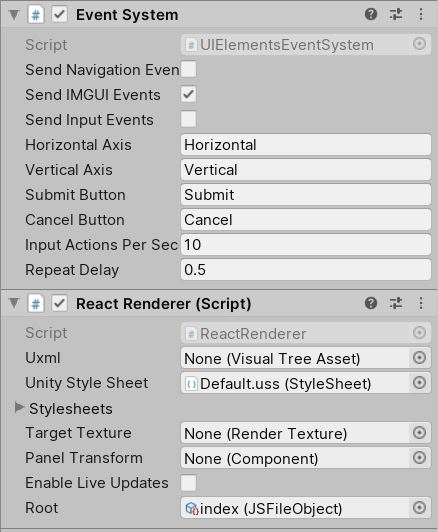

# Unity UIElements React integration

This is an experimental project integrating ReactJS with unity UIElements.


## How to install

Add a dependency into your `manifest.json`.

```json
{
  "dependencies": {
    "com.mkmarek.uielements.react": "https://github.com/mkmarek/unity-react-uielements.git#releases/v0.0.1",
  }
}
```

## How to start

1. In your unity `Assets` folder create a `Resources` folder.
2. Using whatever file editor you like create a `index.jsx` file inside that `Resources` folder.
3. Paste the following content inside the `index.jsx` file.

```jsx
import React from 'react';
import { render } from 'unity-renderer';

const style = {
  width: "80%",
  height: "80%",
  backgroundColor: "#ffffff",
  fontSize: 21,
  alignSelf: 'center',
  alignItems: 'center',
  justifyContent: 'center'
}

function App() {
  return <element style={style}>
    Hello Unity!
  </element>
}

render(<App />)
```

4. In your Unity scene create a new empty object and add `ReactRenderer` and `EventSystem` monobehaviours to it with the following settings.



Set the root property to your `index.jsx`. Just drag it from your `Resources` folder into the field.

For bigger example look into the examples folder.

## How does it work

Check the [wiki](https://github.com/mkmarek/unity-react-uielements/wiki) for more information.